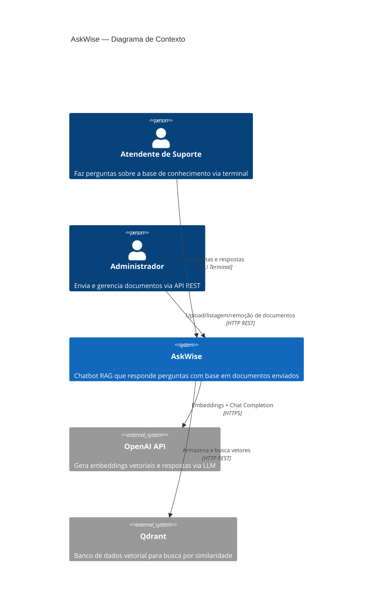
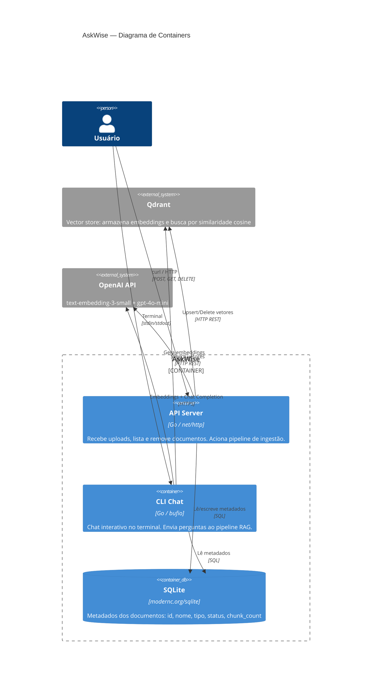
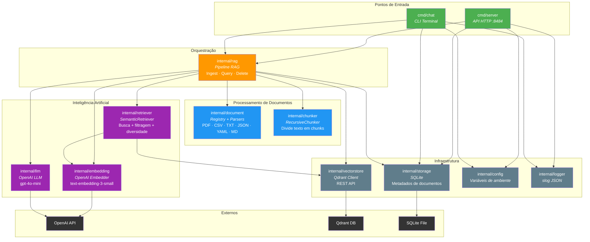
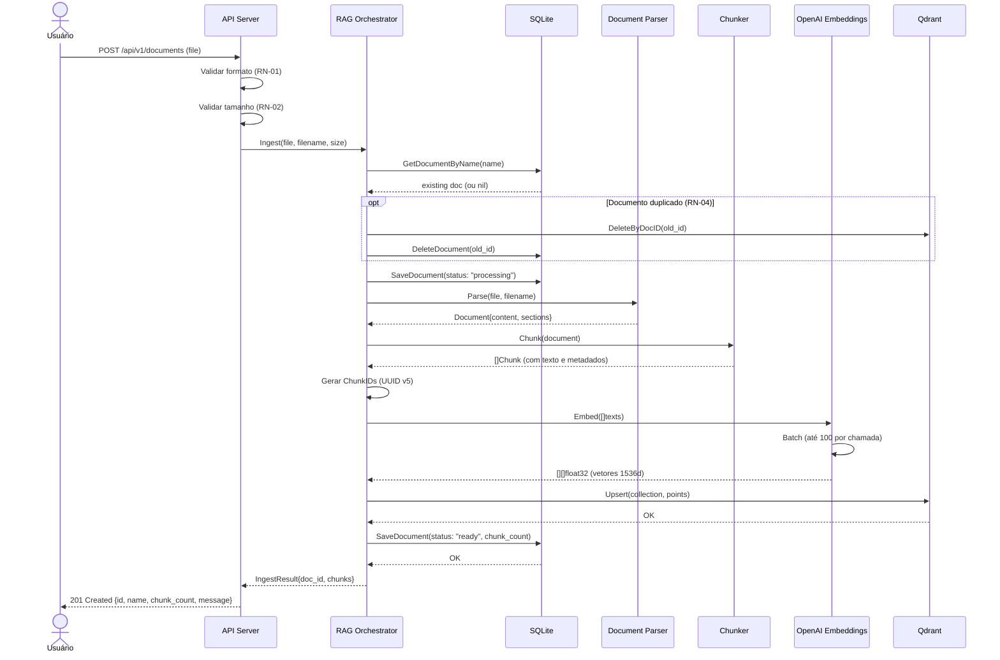
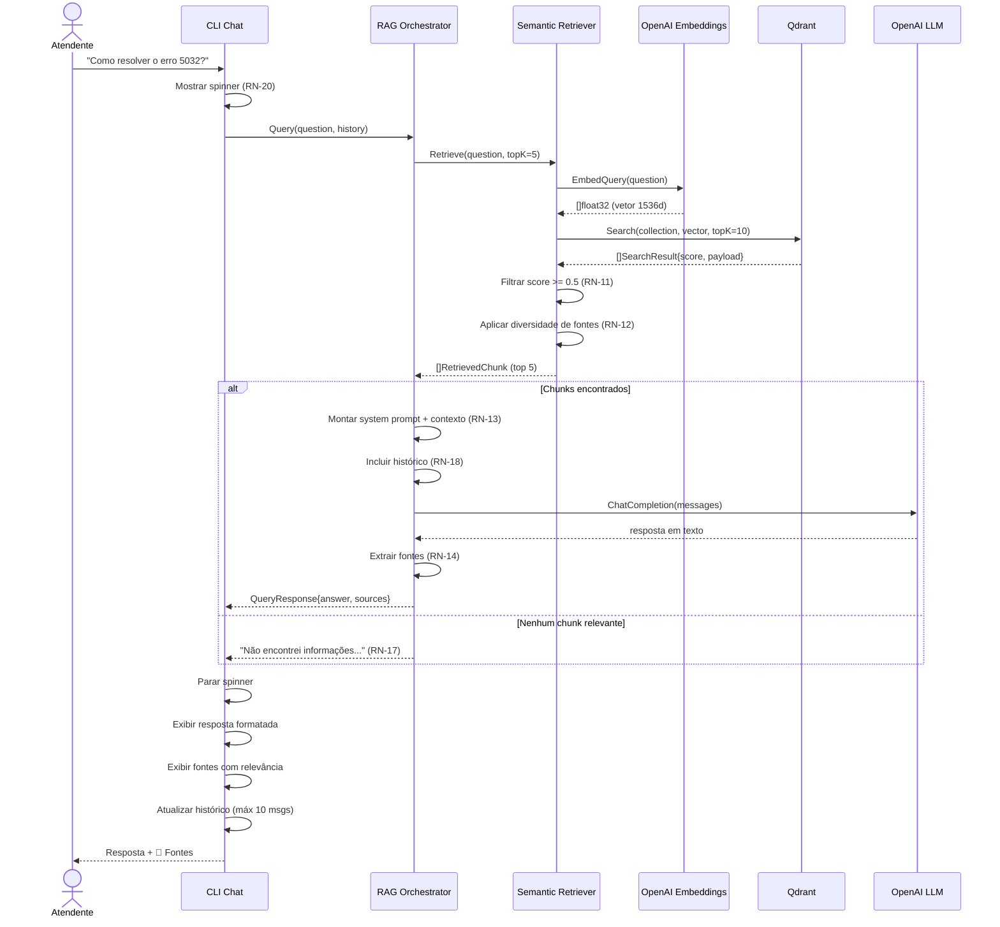
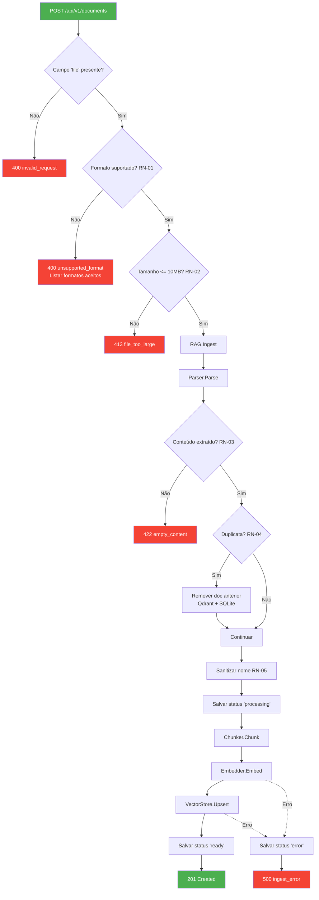
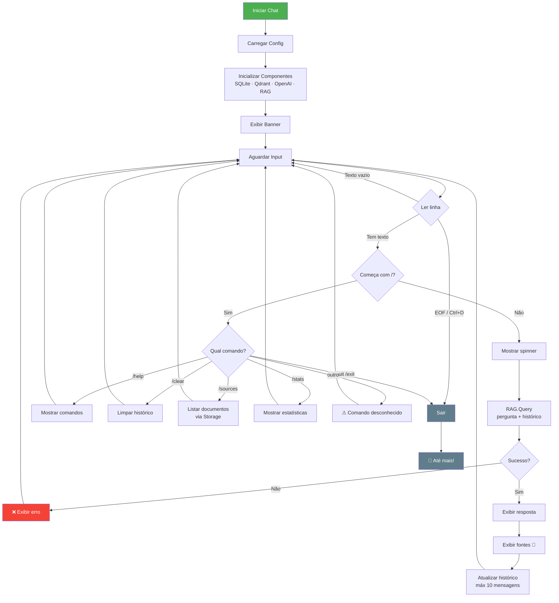
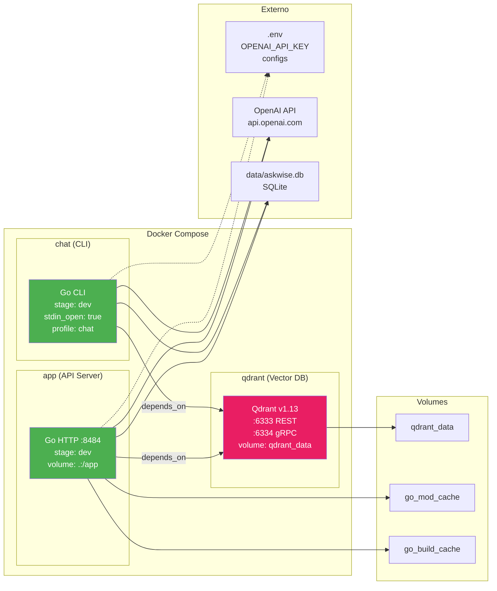
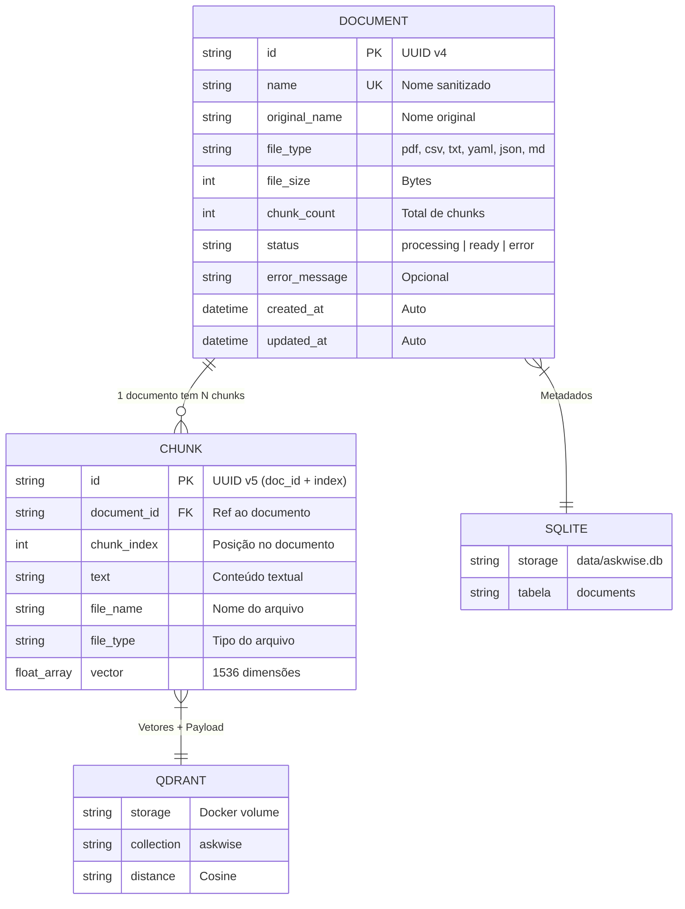

# Diagramas — AskWise

Diagramas de arquitetura e fluxo do sistema AskWise, usando notação
[Mermaid](https://mermaid.js.org/) para renderização nativa no GitHub.

---

## 1. C4 — Contexto do Sistema

Visão de mais alto nível: quem interage com o AskWise e quais sistemas externos ele utiliza.

---

## 2. C4 — Containers

Os containers que compõem o sistema e como se comunicam.

---

## 3. C4 — Componentes (Pacotes Go)

Os pacotes internos do AskWise e suas dependências.

---

## 4. Sequência — Pipeline de Ingestão (Upload)

O fluxo completo quando um documento é enviado via `POST /api/v1/documents`.

---

## 5. Sequência — Pipeline de Consulta (Chat)

O fluxo quando o usuário faz uma pergunta no CLI.

---

## 6. Fluxo — Validação de Upload

Decisões tomadas durante o upload de um documento.

---

## 7. Fluxo — Loop do CLI Chat

Interação do usuário com o chat interativo.

---

## 8. Infraestrutura — Docker Compose

Como os containers se relacionam na stack Docker.

---

## 9. Modelo de Dados

Relação entre as entidades armazenadas no SQLite e no Qdrant.

---

## Legenda de Cores

| Cor | Significado |
|-----|-------------|
| 🟢 Verde | Pontos de entrada (API, CLI) |
| 🟠 Laranja | Orquestração (RAG) |
| 🔵 Azul | Processamento de documentos |
| 🟣 Roxo | Inteligência artificial (OpenAI) |
| ⚫ Cinza | Infraestrutura e storage |
| 🔴 Vermelho | Erros e respostas de falha |
